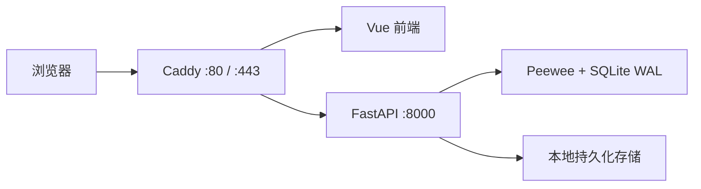

# CodeDrop

CodeDrop 是一个面向个人和小团队的临时文件分享服务。发送方无需注册，通过浏览器分片上传文件并获得六位取件码；接收方输入取件码即可下载。

项目重点不是堆叠技术，而是用一套容易读懂的代码完整展示：

- 5 MiB 固定分片、失败重试和断点续传
- 分片 SHA-256 校验与幂等上传
- 流式合并，避免把完整文件读入内存
- 文件按时间和下载次数失效
- 数据库条件更新解决限次下载的并发竞争
- SQLite、本地磁盘和单进程的低成本部署

完整产品边界见 [PRD](docs/PRD.md)，推荐阅读顺序见 [学习指南](docs/LEARNING_GUIDE.md)。

## 为什么做这个项目

临时传输文件时，网盘往往要求注册、安装客户端，免费用户还可能受到产品策略限制。CodeDrop 提供一个可以自行部署的简单选择：服务端不区分会员等级，也不主动限速，文件到期后自动清理。

需要特别说明：

- CodeDrop 不会突破云服务器的带宽上限。
- 分片上传改善的是失败重试成本和可恢复性，不会凭空提高总带宽。
- 它适合临时分享，不是长期网盘、对象存储或多用户协作平台。

## 第一版范围

包含：

- 单文件分片上传、暂停、继续和取消
- 上传进度查询、分片校验和安全合并
- 六位取件码、短期下载凭证和 HTTP Range 下载
- 分享过期、下载次数限制和自动清理
- 简单的管理员登录、文件列表和删除
- Docker Compose 单机部署

不包含用户系统、多文件上传、在线预览、文件去重、对象存储、Redis、消息队列和多机部署。

## 架构



代码保持四个直接层次：

```text
HTTP 路由 → Pydantic Schema → Service → Peewee Model / 文件系统
```

没有额外引入 Repository、领域事件或消息队列。阻塞的 Peewee 和文件操作放在 FastAPI 的同步路由中，由其线程池执行。

## 云服务器限制

默认配置针对 1～2 vCPU、1～2 GiB 内存、20～40 GiB 系统盘的低价单机服务器：

| 项目 | 限制 |
|---|---:|
| 单文件硬上限 | 200 MiB |
| 默认分片大小 | 5 MiB |
| 前端上传并发 | 3 个分片 |
| CodeDrop 总存储配额 | 5 GiB |
| 必须保留的磁盘空间 | 2 GiB |
| 未完成上传保留时间 | 2 小时 |
| 文件默认 / 最长保存时间 | 6 / 24 小时 |
| 最大下载次数 | 5 次 |
| Uvicorn worker | 1 |

合并期间，分片和最终文件会短暂同时存在，因此初始化上传和合并前都会检查磁盘空间。200 MiB 是服务端硬上限，不应只依赖前端校验。

带宽往往比 CPU 更早成为瓶颈。以 3 Mbps 公网带宽为例，理想情况下传输 200 MiB 也需要约 9 分钟，实际时间通常更长；上传和下载还会分别消耗流量。线上演示建议使用 20～50 MiB 文件。

## 快速开始

### 方式一：Docker Compose

要求：Docker 与 Docker Compose。

1. 创建本地配置：

   ```bash
   cp .env.example .env
   ```

   Windows PowerShell：

   ```powershell
   Copy-Item .env.example .env
   ```

2. 修改 `.env` 中所有 `change-me` 值。可以生成应用密钥和下载密钥：

   ```bash
   python -c "import secrets; print(secrets.token_urlsafe(48))"
   ```

3. 为管理员密码生成 PBKDF2 哈希：

   ```bash
   docker compose run --build --rm backend python -m app.core.security hash-password "换成你的密码"
   ```

   将输出粘贴到 `ADMIN_PASSWORD_HASH`，不要填写明文密码。哈希中含有 `$`，请保留 `.env.example` 中该值两侧的单引号。

4. 构建并启动：

   ```bash
   docker compose up --build -d
   ```

5. 访问：

   - Web 页面：<http://localhost>
   - Swagger：<http://localhost/docs>
   - 健康检查：<http://localhost/health>

6. 查看日志或停止：

   ```bash
   docker compose logs -f
   docker compose down
   ```

`docker compose down` 不会删除宿主机的 `data/` 和 `storage/`。不要使用 `down -v` 清理生产环境，除非确定不再需要证书数据。

### 方式二：本地开发

本地开发不需要先进入 Docker。后端使用虚拟环境，前端使用 Vite，修改代码后反馈更快。

后端（PowerShell，新终端）：

```powershell
py -3.12 -m venv .venv
.\.venv\Scripts\python -m pip install -r backend\requirements-dev.txt
$env:PYTHONPATH = "backend"
.\.venv\Scripts\python -m uvicorn app.main:app --reload --port 8000
```

前端（另一个终端）：

```powershell
cd frontend
npm ci
npm run dev
```

访问 <http://localhost:5173>。Vite 会把 `/api` 和 `/health` 代理到本地后端。后端默认把运行数据写入仓库根目录的 `data/` 与 `storage/`，它们已被 Git 忽略。

## 部署到云服务器

1. 将域名解析到服务器，开放 80 和 443 端口。
2. 在 `.env` 中把 `SITE_ADDRESS` 改为真实域名，例如 `files.example.com`。
3. 设置强随机的应用密钥、下载密钥和上传口令。
4. 配置管理员密码，不要把真实 `.env` 提交到 Git。
5. 执行 `docker compose up --build -d`，Caddy 会自动申请 HTTPS 证书。
6. 定期检查 `docker compose logs`、磁盘剩余空间和云厂商流量额度。

公网部署必须开启上传口令。若服务器磁盘剩余不足 20%，应立即停止公开上传并清理文件。

## 测试

后端：

```powershell
$env:PYTHONPATH = "backend"
.\.venv\Scripts\python -m pytest backend\tests -q
```

前端构建：

```powershell
cd frontend
npm run build
```

核心验收场景包括：

- 上传部分分片后刷新页面，只补传缺失分片
- 重复上传相同分片仍只保留一条记录
- 分片缺失或哈希错误时拒绝合并
- 合并前后的 SHA-256 一致
- 下载限制为 1 时，并发请求只有一个获得凭证
- 重启容器后数据库、分片和正式文件仍然存在

## 学习与面试演示

建议先理解普通上传，再学习断点续传和并发控制。不要从前端页面倒推全部代码，按 [学习指南](docs/LEARNING_GUIDE.md) 的顺序逐步运行接口和测试。

推荐演示流程：

1. 选择一个 20～50 MiB 文件并开始上传。
2. 展示文件被拆为多个 5 MiB 分片。
3. 暂停并刷新页面，再继续缺失分片。
4. 上传完成后展示合并阶段和六位取件码。
5. 使用取件码查看元数据并下载。
6. 展示一次限次下载测试和管理员存储页面。

面试时应能解释：为什么选择同步 Peewee、为什么 SQLite 使用 WAL 和短事务、为什么文件合并不能放在数据库事务中，以及为什么下载次数在签发凭证时原子扣减。

## 数据安全

- 上传内容只保存、不执行、不解压、不在线预览。
- 文件真实存储名使用随机 ID，不直接拼接用户文件名。
- `.env`、SQLite 数据库和上传目录默认不会进入 Git。
- 本项目未集成病毒扫描或内容审核，不应直接作为完全匿名的公共上传服务。

## License

本项目的许可证将在正式发布前确定。引入第三方依赖时应分别遵循其许可证。
