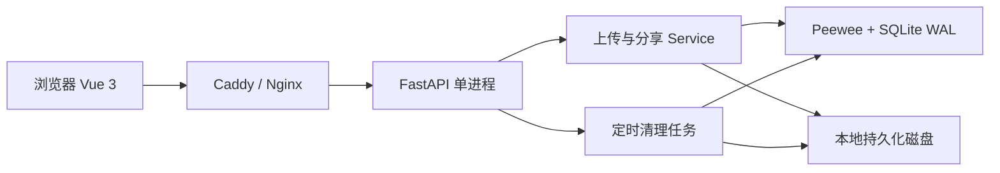
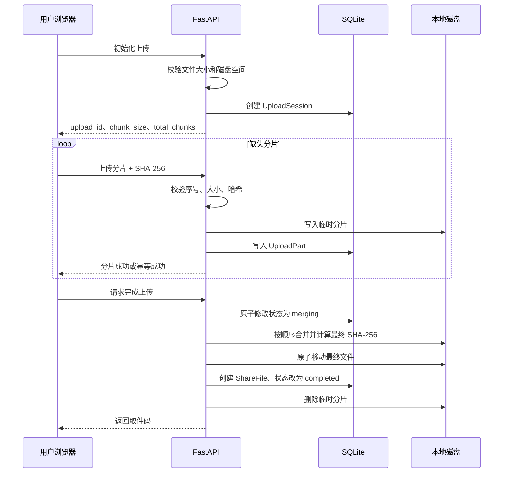
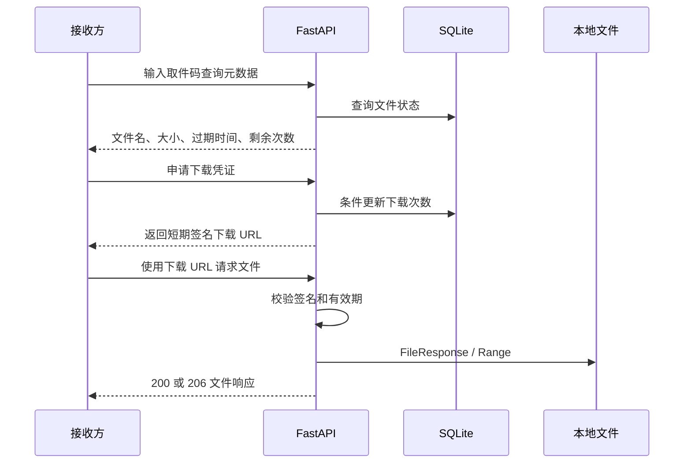

# LiteDrop 大文件快传系统 PRD

> 文档版本：v1.0
> 文档状态：开发基线草案
> 更新日期：2026-07-24
> 产品形态：部署于低配云服务器的 Web 文件临时分享服务
> 核心技术：FastAPI、Peewee、SQLite、Vue 3、Docker

---

## 1. 文档目的

本文档定义 LiteDrop 第一版的产品范围、业务规则、功能需求、接口边界、数据模型、非功能需求、部署限制和验收标准。

第一版遵循以下原则：

1. 代码独立实现，不复制 FileCodeBox 的代码、资源、命名或文件结构。
2. 参考同类产品的业务流程，但只保留最有价值的功能。
3. 以代码简洁、可读、可测试为优先目标。
4. 分片上传和断点续传是项目的主要技术亮点。
5. 适配最低配云服务器，不将项目设计成网盘或分布式存储系统。
6. 所有功能应当能够由项目开发者在面试中解释清楚。

---

## 2. 产品概述

### 2.1 产品名称

产品名称：**LiteDrop**

中文名称：**简传**

### 2.2 一句话介绍

LiteDrop 是一个无需注册、支持分片上传和断点续传的云端临时文件分享系统。上传完成后生成取件码，接收方可通过取件码下载文件。

### 2.3 产品背景

日常临时传输文件时，部分网盘产品存在以下使用成本：

- 发送方和接收方需要注册或登录。
- 下载大文件时可能要求安装客户端。
- 免费用户可能受到产品策略限制。
- 临时文件长期占用个人网盘空间。
- 团队内部文件需要经过第三方平台保存。

LiteDrop 不承诺突破物理网络带宽，也不宣称下载速度一定高于网盘。它提供的是：

- 无需用户注册。
- 无需安装专用客户端。
- 服务端不设置会员等级和人为限速。
- 支持部署在个人或团队自己的服务器上。
- 文件自动过期，适合临时交换。
- 大文件上传失败后可以继续上传。

### 2.4 产品定位

LiteDrop 面向个人开发者、小团队、实验室和面试演示场景，属于单机轻量应用。

LiteDrop 不是：

- 百度网盘等大型网盘产品的替代品。
- 分布式对象存储系统。
- 长期文件归档系统。
- 多用户协作平台。
- 点对点传输工具。

---

## 3. 产品目标

### 3.1 核心目标

1. 用户可以通过浏览器上传文件并获得取件码。
2. 大文件采用固定大小分片上传。
3. 上传中断后可以查询已上传分片并继续上传。
4. 服务端校验每个分片的 SHA-256。
5. 服务端安全、幂等地合并全部分片。
6. 接收方可以通过取件码查询并下载文件。
7. 文件可以按时间和下载次数失效。
8. 系统能够自动清理过期文件和未完成上传。
9. 系统能够在最低配单机服务器上稳定运行。
10. 管理员可以查看存储使用情况并删除文件。

### 3.2 工程目标

- 路由、模型、Schema、Service 分层清晰。
- 不引入不必要的 Repository、DDD、消息队列和微服务。
- 核心业务具备自动化测试。
- 支持 Docker Compose 一键运行。
- 支持 Swagger/OpenAPI 调试。
- 所有配置通过环境变量管理。

### 3.3 成功标准

- 12 MiB 测试文件可以拆分为多个分片并成功合并。
- 浏览器刷新后能够继续未完成上传。
- 重复上传相同分片不会生成重复数据。
- 缺失或损坏分片时拒绝合并。
- 合并后的文件 SHA-256 与原文件一致。
- 下载次数为 1 时，并发申请下载只有一个请求成功。
- 支持 HTTP Range 下载和断点续传。
- 服务重启后上传会话和分享记录仍然存在。
- 过期数据能够自动从数据库和磁盘中删除。
- 云服务器不会因为单个用户上传大文件而占满磁盘。

---

## 4. 目标用户与使用场景

### 4.1 目标用户

#### 发送方

需要临时发送文件，不希望要求对方注册网盘账号。

#### 接收方

希望通过一个简短取件码直接获得文件。

#### 管理员

负责部署服务、查看存储空间、清理异常文件和控制公开上传。

### 4.2 典型场景

#### 场景 A：临时发送项目压缩包

发送方上传一个 150 MiB 的项目压缩包，系统生成取件码。接收方在 24 小时内输入取件码下载。

#### 场景 B：弱网络环境下继续上传

发送方上传过程中网络断开。刷新页面后，前端读取本地保存的 `upload_id`，查询服务端已收到的分片，只继续上传缺失部分。

#### 场景 C：一次性领取

发送方设置下载次数为 1。系统只允许成功签发一个下载凭证，后续领取请求返回下载次数已用完。

#### 场景 D：管理员控制演示服务器

管理员发现存储空间不足，通过后台删除大文件、关闭公开上传或调整上传口令。

---

## 5. 部署资源与容量策略

### 5.1 最低部署假设

系统按照以下保守配置设计：

| 资源 | 最低兼容配置 | 推荐低价配置 |
|---|---:|---:|
| CPU | 1 vCPU | 2 vCPU |
| 内存 | 1 GiB | 2 GiB |
| 系统盘 | 20 GiB | 40 GiB |
| 公网带宽 | 1 Mbps | 3 Mbps 或以上 |
| 进程数量 | 1 个 Uvicorn worker | 1 个 Uvicorn worker |
| 数据库 | SQLite WAL | SQLite WAL |

当前轻量服务器公开规格中存在 2 vCPU、2 GiB、40 GiB SSD、3 Mbps 带宽的入门套餐，因此 PRD 使用该配置作为主要部署基准，但系统不能依赖某个特定云厂商。

### 5.2 为什么必须限制文件大小

文件分片只能降低单次请求大小和失败重传成本，不能消除以下资源消耗：

- 分片文件本身占用磁盘。
- 合并期间分片和最终文件会同时存在，短时间约占用文件大小的两倍。
- 下载会消耗服务器公网流量。
- 低带宽服务器传输数百 MiB 文件需要较长时间。
- 公网匿名服务可能被恶意占满磁盘。

### 5.3 单文件大小上限

系统只面向低配云服务器部署，第一版不区分本地能力上限和公网开放上限，统一限制为：

```text
MAX_FILE_SIZE = 200 MiB
```

原因：

- 足以完整展示分片、暂停、重试和断点续传。
- 对 20～40 GiB 系统盘风险较低。
- 在低价服务器带宽下仍可完成真实演示。
- 可降低恶意上传和流量消耗。

面试现场建议使用 20～50 MiB 文件演示，以减少等待时间。

### 5.4 动态磁盘检查

不能只依赖固定文件大小上限。初始化上传时还必须检查实时磁盘空间。

初始化条件：

```text
可用磁盘空间 >= 文件总大小 × 2 + 磁盘保留空间
```

默认磁盘保留空间：

```text
DISK_RESERVE_SIZE = 2 GiB
```

合并前再次检查：

```text
可用磁盘空间 >= 文件总大小 + 磁盘保留空间
```

若不满足条件，返回 `507 Insufficient Storage`。

### 5.5 全局存储限制

云服务器统一配置：

```text
STORAGE_QUOTA = 5 GiB
```

计入配额的数据：

- 已完成文件。
- 未完成分片。
- 正在合并的临时文件。

不实现复杂的数据库容量预留机制。第一版使用数据库统计值加磁盘实时检查，允许存在少量并发误差。

### 5.6 生命周期限制

云服务器统一规则：

| 项目 | 默认值 | 最大值 |
|---|---:|---:|
| 完成文件保存时间 | 6 小时 | 24 小时 |
| 未完成上传保存时间 | 2 小时 | 2 小时 |
| 下载凭证有效时间 | 30 分钟 | 2 小时 |
| 下载次数 | 3 次 | 5 次 |
| 单 IP 活跃上传会话 | 1 个 | 1 个 |

第一版固定单文件上限为 200 MiB，不允许通过管理后台或环境变量提高。环境变量只能将运行时限制调低；如需提高硬上限，必须作为后续版本重新评估磁盘、带宽和流量成本。

---

## 6. 产品范围

### 6.1 第一版包含

- 文件上传初始化。
- 固定大小分片上传。
- 分片 SHA-256 校验。
- 重复分片幂等处理。
- 查询上传进度。
- 暂停与继续上传。
- 取消上传。
- 分片完整性检查。
- 分片合并。
- 最终文件 SHA-256 计算。
- 六位数字取件码。
- 文件元数据查询。
- 下载次数限制。
- 文件时间过期。
- 短期下载凭证。
- HTTP Range 下载。
- 管理员登录。
- 文件列表与删除。
- 存储使用情况。
- 公开上传开关。
- 上传口令。
- 自动清理任务。
- 健康检查。
- Docker Compose 部署。

### 6.2 第一版不包含

- 用户注册、用户资料和找回密码。
- 文件夹上传。
- 多文件打包上传。
- 文本分享。
- 在线预览。
- 图片缩略图。
- 视频转码。
- 病毒扫描。
- 文件内容审核。
- 文件去重和秒传。
- 文件加密存储。
- S3、WebDAV、OneDrive 等外部存储。
- Redis。
- Celery。
- 消息队列。
- WebSocket。
- 多机部署。
- 多 Uvicorn worker。
- 多租户。
- 会员、支付和套餐。
- 上传速度保证。

---

## 7. 核心业务流程

### 7.1 系统架构



### 7.2 分片上传流程



### 7.3 下载流程

下载采用“领取下载凭证”和“文件传输”两步，避免浏览器 Range 请求被重复计算为多次下载。



---

## 8. 详细功能需求

### 8.1 上传首页

#### 页面元素

- 产品名称和一句话说明。
- 文件选择区域。
- 拖拽上传区域。
- 文件名、文件大小展示。
- 保存时间选择。
- 下载次数选择。
- 上传口令输入框，仅公网模式显示。
- 开始上传按钮。
- 上传进度、速度和剩余时间。
- 暂停、继续、取消按钮。
- 上传完成后的取件码和复制按钮。

#### 交互规则

- 第一版一次只允许选择一个文件。
- 文件选择后立即在前端校验大小。
- 前端按服务端返回的分片大小切片。
- 默认同时上传 3 个分片。
- 单个分片失败后最多自动重试 3 次。
- 重试间隔采用 1 秒、2 秒、4 秒。
- 暂停只停止发送新分片，不删除服务端数据。
- 浏览器使用 `localStorage` 保存未完成上传信息。
- 页面刷新后自动询问是否继续未完成上传。

### 8.2 初始化上传

客户端提交：

```json
{
  "file_name": "demo.zip",
  "total_size": 125829120,
  "expire_hours": 6,
  "download_limit": 3
}
```

服务端负责：

1. 校验公开上传是否开启。
2. 校验上传口令。
3. 清理和标准化文件名。
4. 校验文件总大小。
5. 校验保存时间和下载次数。
6. 检查 IP 活跃上传会话。
7. 检查全局存储配额。
8. 检查实时磁盘空间。
9. 根据服务端配置确定 `chunk_size`。
10. 计算 `total_chunks`。
11. 创建上传会话。

返回：

```json
{
  "upload_id": "b84f7f5a-....",
  "chunk_size": 5242880,
  "total_chunks": 24,
  "expires_at": "2026-07-24T14:00:00Z"
}
```

### 8.3 上传分片

请求格式：

```text
PUT /api/uploads/{upload_id}/chunks/{part_number}
Content-Type: multipart/form-data

chunk: 二进制分片
chunk_sha256: 64 位十六进制字符串
```

规则：

- 分片编号从 0 开始。
- `part_number` 必须小于 `total_chunks`。
- 非最后一个分片必须等于服务端指定的 `chunk_size`。
- 最后一个分片大小必须与剩余字节数一致。
- 服务端以流式方式计算 SHA-256。
- 服务端不能直接采用用户文件名作为磁盘路径。
- 分片先写入 `.part.tmp`，校验成功后使用 `os.replace()` 原子重命名。
- 数据库记录只能在磁盘写入成功后创建。

幂等规则：

- 同编号分片已存在且 SHA-256 相同：返回成功，并标记 `idempotent=true`。
- 同编号分片已存在但 SHA-256 不同：返回 `409 CHUNK_CONFLICT`。
- 会话不处于 `uploading` 状态：返回 `409 UPLOAD_STATE_CONFLICT`。

### 8.4 查询上传状态

返回：

```json
{
  "upload_id": "...",
  "file_name": "demo.zip",
  "total_size": 125829120,
  "chunk_size": 5242880,
  "total_chunks": 24,
  "uploaded_parts": [0, 1, 2, 5],
  "uploaded_bytes": 20971520,
  "status": "uploading",
  "expires_at": "..."
}
```

前端根据 `uploaded_parts` 只上传缺失分片。

### 8.5 完成上传

完成请求必须：

1. 原子地将状态从 `uploading` 改为 `merging`。
2. 检查所有分片记录和磁盘文件。
3. 检查分片总大小等于声明的文件大小。
4. 再次检查磁盘剩余空间。
5. 按分片编号顺序合并。
6. 合并过程中计算最终文件 SHA-256。
7. 写入 `.merge.tmp` 临时文件。
8. 刷新并关闭文件后使用 `os.replace()` 移动为正式文件。
9. 生成唯一六位数字取件码。
10. 在短事务中创建分享记录。
11. 将上传会话状态改为 `completed`。
12. 删除临时分片和分片数据库记录。

重复完成请求：

- 已完成：返回原取件码。
- 正在合并：返回 `409 UPLOAD_ALREADY_MERGING`。
- 缺少分片：状态恢复为 `uploading` 并返回缺失编号。

### 8.6 取消上传

- 仅允许取消 `uploading` 或 `failed` 状态会话。
- 删除所有临时分片。
- 删除上传分片记录。
- 上传会话标记为 `cancelled` 或直接删除。
- 已完成的分享不能通过该接口删除。

### 8.7 取件码

- 取件码为六位数字字符串。
- 必须保留前导零。
- 数据库设置唯一索引。
- 发生冲突时重新生成。
- 取件码不应连续递增。

示例：

```text
028471
```

### 8.8 查询分享文件

输入取件码后返回：

```json
{
  "code": "028471",
  "file_name": "demo.zip",
  "size": 125829120,
  "sha256": "...",
  "created_at": "...",
  "expires_at": "...",
  "download_limit": 3,
  "download_count": 1,
  "remaining_downloads": 2
}
```

规则：

- 查询元数据不消耗下载次数。
- 文件不存在、已删除或已过期统一向普通用户返回 404。
- 不返回真实磁盘路径和内部文件名。

### 8.9 申请下载凭证

请求：

```text
POST /api/shares/{code}/download-ticket
```

服务端使用单条条件更新消耗一次下载次数：

```sql
UPDATE share_file
SET download_count = download_count + 1
WHERE id = ?
  AND deleted_at IS NULL
  AND expires_at > CURRENT_TIMESTAMP
  AND download_count < download_limit;
```

受影响行数为 0 时，重新查询并返回：

- 文件不存在。
- 文件已过期。
- 下载次数已用完。

成功后签发 HMAC 下载凭证，内容包含：

- 文件记录 ID。
- 签发时间。
- 过期时间。
- 随机 nonce。

返回：

```json
{
  "download_url": "/api/downloads/{ticket}",
  "expires_at": "..."
}
```

### 8.10 文件下载

- 校验下载凭证签名和有效期。
- 查询文件是否被管理员删除。
- 使用 `FileResponse` 返回文件。
- 设置正确的 `Content-Disposition`。
- 支持 `Range` 请求。
- Range 请求不重复消耗下载次数。
- 无效 Range 返回 416。
- 不把完整文件加载到内存。

业务约定：

- 下载次数在签发凭证时消耗，而不是在文件完整传输后消耗。
- 用户中途取消下载也不会返还次数。
- 凭证有效期内可使用 Range 继续下载。
- 分享到期后不再签发新凭证。
- 为保证已签发凭证完成下载，物理文件在业务过期后延迟一个凭证有效期再删除。

### 8.11 管理员登录

- 第一版只有一个管理员。
- 不提供管理员注册。
- 管理员密码哈希通过环境变量提供。
- 登录成功签发 JWT。
- JWT 默认有效 8 小时。
- 管理接口使用 Bearer Token。
- 连续登录失败需要进行简单 IP 频率限制。

### 8.12 管理后台

管理员可以：

- 查看文件总数。
- 查看完成文件占用空间。
- 查看未完成上传占用空间。
- 查看磁盘剩余空间。
- 查看上传是否开放。
- 按状态筛选文件。
- 按文件名或取件码搜索。
- 删除单个文件。
- 删除过期文件。
- 清理未完成上传。

第一版不提供复杂图表。

### 8.13 自动清理

单个应用进程通过 lifespan 启动一个清理循环。

默认每 30 分钟执行：

1. 删除超过 2 小时未完成的上传会话。
2. 删除对应临时分片和记录。
3. 删除超过业务过期时间加下载凭证宽限期的文件。
4. 删除标记为删除但磁盘仍残留的文件。
5. 清理孤立 `.tmp` 文件。

要求：

- 清理失败需要记录日志，但不能终止应用。
- 数据库记录和文件删除应允许重试。
- 只部署一个 Uvicorn worker，避免重复调度。

### 8.14 健康检查

```text
GET /health
```

返回：

```json
{
  "status": "ok",
  "database": "ok",
  "storage": "ok",
  "free_disk_bytes": 1234567890,
  "version": "1.0.0"
}
```

不返回密码、密钥、绝对磁盘路径等敏感信息。

---

## 9. API 清单

| 方法 | 路径 | 权限 | 说明 |
|---|---|---|---|
| POST | `/api/uploads` | 上传口令可选 | 初始化上传 |
| GET | `/api/uploads/{upload_id}` | upload_id | 查询进度 |
| PUT | `/api/uploads/{upload_id}/chunks/{part_number}` | upload_id | 上传分片 |
| POST | `/api/uploads/{upload_id}/complete` | upload_id | 合并分片 |
| DELETE | `/api/uploads/{upload_id}` | upload_id | 取消上传 |
| GET | `/api/shares/{code}` | 公开 | 查询文件 |
| POST | `/api/shares/{code}/download-ticket` | 公开 | 消耗次数并签发下载凭证 |
| GET | `/api/downloads/{ticket}` | 下载凭证 | 下载或 Range 下载 |
| POST | `/api/admin/login` | 公开 | 管理员登录 |
| GET | `/api/admin/overview` | 管理员 | 存储概览 |
| GET | `/api/admin/files` | 管理员 | 文件列表 |
| DELETE | `/api/admin/files/{file_id}` | 管理员 | 删除文件 |
| POST | `/api/admin/cleanup` | 管理员 | 手动清理 |
| GET | `/health` | 公开 | 健康检查 |

---

## 10. 数据模型

### 10.1 UploadSession

| 字段 | 类型 | 约束 | 说明 |
|---|---|---|---|
| id | UUID/Text | 主键 | 上传会话 ID |
| file_name | Text | 非空 | 清理后的原文件名 |
| total_size | BigInteger | 非空 | 文件总大小 |
| chunk_size | Integer | 非空 | 分片大小 |
| total_chunks | Integer | 非空 | 分片数量 |
| status | Text | 索引 | uploading/merging/completed/failed |
| expire_hours | Integer | 非空 | 分享保存时间 |
| download_limit | Integer | 非空 | 下载次数限制 |
| client_ip_hash | Text | 可空 | IP 哈希，不保存完整 IP |
| share_id | ForeignKey | 可空 | 完成后对应的 ShareFile |
| created_at | DateTime | 索引 | 创建时间 |
| updated_at | DateTime | 非空 | 更新时间 |
| expires_at | DateTime | 索引 | 未完成会话失效时间 |

### 10.2 UploadPart

| 字段 | 类型 | 约束 | 说明 |
|---|---|---|---|
| id | AutoField | 主键 | 记录 ID |
| upload_id | ForeignKey | 索引 | 所属会话 |
| part_number | Integer | 非空 | 分片编号 |
| size | Integer | 非空 | 分片大小 |
| sha256 | Char(64) | 非空 | 分片哈希 |
| created_at | DateTime | 非空 | 创建时间 |

唯一约束：

```text
(upload_id, part_number)
```

### 10.3 ShareFile

| 字段 | 类型 | 约束 | 说明 |
|---|---|---|---|
| id | UUID/Text | 主键 | 文件记录 ID |
| code | Char(6) | 唯一索引 | 六位取件码 |
| original_name | Text | 非空 | 展示文件名 |
| stored_name | Text | 唯一 | 磁盘内部文件名 |
| relative_path | Text | 非空 | 相对存储路径 |
| size | BigInteger | 非空 | 文件大小 |
| sha256 | Char(64) | 非空 | 最终文件哈希 |
| mime_type | Text | 可空 | 仅用于下载响应 |
| download_limit | Integer | 非空 | 最大下载次数 |
| download_count | Integer | 默认 0 | 已签发下载次数 |
| created_at | DateTime | 索引 | 创建时间 |
| expires_at | DateTime | 索引 | 业务过期时间 |
| deleted_at | DateTime | 可空 | 管理员删除时间 |

---

## 11. 文件存储结构

```text
storage/
├── uploads/
│   └── {upload_id}/
│       ├── 000000.part
│       ├── 000001.part
│       └── ...
├── merging/
│   └── {share_id}.merge.tmp
└── files/
    └── 2026/
        └── 07/
            └── {share_id}.bin
```

规则：

- 用户文件名永远不参与真实存储路径拼接。
- 数据库存储相对路径，不存储不可移植的绝对路径。
- 所有路径在使用前必须执行 `resolve()` 并验证仍位于存储根目录下。
- 禁止通过 `../`、绝对路径或符号链接逃逸存储目录。

---

## 12. 非功能需求

### 12.1 性能

- 上传和合并不得一次性将完整文件读入内存。
- 单个分片默认 5 MiB。
- 前端默认并发上传 3 个分片。
- 合并缓冲区默认 1 MiB。
- 200 MiB 文件上传期间应用内存目标低于 256 MiB。
- SQLite 使用 WAL 模式。
- 数据库事务中不得执行耗时文件复制或合并。
- 文件下载使用 `FileResponse`，支持 Range。

### 12.2 可靠性

- 分片写入使用临时文件加原子重命名。
- 合并使用临时文件加原子重命名。
- 完成接口必须幂等。
- 服务重启后可以继续查询和上传缺失分片。
- 磁盘写入成功后才写入分片记录。
- 合并失败后保留已有分片，允许重试。
- 清理任务允许重复执行。

### 12.3 安全

- 公网部署必须启用上传口令。
- 所有文件大小和分片大小由服务端验证。
- 不信任客户端 MIME 类型。
- 不执行、不解压、不预览上传内容。
- 真实存储文件名使用 UUID。
- 管理员密码只保存哈希。
- JWT 和下载签名密钥来自环境变量。
- 密钥不得提交到 Git。
- 日志不得记录 JWT、上传口令和下载凭证。
- CORS 仅允许配置的前端域名。
- 生产环境启用 HTTPS。
- 反向代理限制单次请求体大小略高于分片大小。
- 管理接口和上传初始化接口需要频率限制。
- 错误响应不能泄露绝对路径和调用栈。

### 12.4 可维护性

- 业务逻辑主要位于 Service，不堆积在路由函数。
- 单个函数目标不超过约 50 行，复杂流程拆分为具名步骤。
- 使用明确类型注解。
- 统一错误响应结构。
- 配置集中在 `core/config.py`。
- 模型不直接处理 HTTP 请求。
- 不创建没有实际作用的抽象层。

### 12.5 可观测性

- 每个请求生成 request_id。
- 关键日志包含 upload_id 或 share_id。
- 记录上传初始化、分片失败、合并结果、下载凭证签发和清理结果。
- 不记录文件正文和敏感凭证。
- `/health` 可检查数据库和存储目录。

### 12.6 兼容性

- 桌面端 Chrome、Edge、Firefox 最新两个主要版本。
- 移动端完成基本取件和下载。
- 前端使用 Web Crypto API 计算 SHA-256。
- 不承诺旧版 IE 和非常旧的移动浏览器。

---

## 13. 统一响应与错误码

### 13.1 成功响应

```json
{
  "success": true,
  "data": {},
  "request_id": "..."
}
```

### 13.2 错误响应

```json
{
  "success": false,
  "error": {
    "code": "FILE_TOO_LARGE",
    "message": "文件大小超过当前服务器限制"
  },
  "request_id": "..."
}
```

### 13.3 主要错误码

| HTTP | 业务码 | 说明 |
|---:|---|---|
| 400 | `INVALID_REQUEST` | 请求参数错误 |
| 401 | `INVALID_UPLOAD_ACCESS_CODE` | 上传口令错误 |
| 401 | `ADMIN_UNAUTHORIZED` | 管理员未登录 |
| 404 | `UPLOAD_NOT_FOUND` | 上传会话不存在 |
| 404 | `SHARE_NOT_FOUND` | 文件不存在或不可用 |
| 409 | `CHUNK_CONFLICT` | 同编号分片哈希不同 |
| 409 | `UPLOAD_STATE_CONFLICT` | 上传状态不允许当前操作 |
| 409 | `UPLOAD_ALREADY_MERGING` | 文件正在合并 |
| 422 | `INVALID_CHUNK_INDEX` | 分片编号无效 |
| 422 | `CHUNK_SIZE_MISMATCH` | 分片大小错误 |
| 422 | `CHUNK_HASH_MISMATCH` | 分片哈希错误 |
| 422 | `UPLOAD_INCOMPLETE` | 分片不完整 |
| 429 | `TOO_MANY_REQUESTS` | 请求过于频繁 |
| 410 | `SHARE_EXPIRED` | 文件已过期，仅管理端可区分 |
| 410 | `DOWNLOAD_LIMIT_REACHED` | 下载次数用完 |
| 413 | `FILE_TOO_LARGE` | 文件超过配置上限 |
| 507 | `INSUFFICIENT_STORAGE` | 磁盘空间不足 |
| 507 | `STORAGE_QUOTA_REACHED` | 系统存储配额已满 |

普通取件页面可将不存在、过期和已删除统一展示为“文件不存在或已失效”，减少信息枚举。

---

## 14. 配置项

```text
APP_NAME=LiteDrop
APP_ENV=development
APP_SECRET=change-me
DOWNLOAD_SECRET=change-me

DATABASE_PATH=/app/data/litedrop.db
STORAGE_ROOT=/app/storage

CHUNK_SIZE_BYTES=5242880
MAX_CHUNK_SIZE_BYTES=6291456
MAX_FILE_SIZE_BYTES=209715200
STORAGE_QUOTA_BYTES=5368709120
DISK_RESERVE_BYTES=2147483648

UPLOAD_SESSION_TTL_MINUTES=120
DEFAULT_SHARE_EXPIRE_HOURS=6
MAX_SHARE_EXPIRE_HOURS=24
DOWNLOAD_TICKET_TTL_MINUTES=30
MAX_DOWNLOAD_LIMIT=5

PUBLIC_UPLOAD_ENABLED=true
UPLOAD_ACCESS_CODE=change-me

ADMIN_USERNAME=admin
ADMIN_PASSWORD_HASH=change-me
ADMIN_TOKEN_EXPIRE_HOURS=8

ALLOWED_ORIGINS=https://example.com
CLEANUP_INTERVAL_MINUTES=30
```

开发环境可以通过 `.env.example` 提供示例，但真实 `.env` 必须加入 `.gitignore`。

---

## 15. 前端页面

### 15.1 上传页

状态：

```text
idle
selected
initializing
uploading
paused
merging
completed
failed
```

必须清晰展示当前阶段。合并阶段不能继续显示“上传 100%”后无反馈，应显示“服务器正在合并分片”。

### 15.2 取件页

- 六位取件码输入框。
- 自动过滤非数字字符。
- 文件元数据卡片。
- 文件大小、过期时间、剩余次数。
- 下载按钮。
- 下载凭证签发失败提示。

### 15.3 管理页

- 登录表单。
- 存储概览。
- 文件列表。
- 状态筛选。
- 文件删除确认。
- 手动清理按钮。
- 公开上传状态只读展示；第一版通过环境变量修改。

### 15.4 视觉原则

- 使用一个主色和中性色。
- 不使用复杂动画和玻璃拟态堆叠。
- 桌面端优先，同时保证移动端可用。
- 错误提示直接说明用户下一步操作。
- 文件大小统一使用 KiB、MiB、GiB 格式。

---

## 16. 测试与验收标准

### 16.1 单元测试

- 取件码生成和冲突重试。
- 文件名清理。
- 路径安全检查。
- 分片数量计算。
- 首尾分片大小计算。
- SHA-256 校验。
- 下载凭证签名、过期和篡改检测。
- 文件大小格式化。

### 16.2 API 集成测试

#### 正常上传

- 初始化 12 MiB 文件。
- 上传全部分片。
- 完成合并。
- 比较最终 SHA-256。
- 获取取件码。

#### 断点续传

- 上传部分分片。
- 模拟客户端重启。
- 查询已上传编号。
- 只上传缺失分片。
- 成功完成。

#### 幂等

- 同一分片上传两次。
- 第二次返回成功且数据库只有一条记录。
- 完成接口调用两次返回同一分享记录。

#### 异常分片

- 越界编号返回 422。
- 错误大小返回 422。
- 错误 SHA-256 返回 422。
- 同编号不同内容返回 409。
- 缺失分片时拒绝完成。

#### 并发下载

- 下载限制设置为 1。
- 并发申请两次下载凭证。
- 只有一次数据库条件更新成功。
- 只有一个请求获得凭证。

#### Range 下载

- 正常下载返回 200。
- 合法 Range 返回 206。
- 无效 Range 返回 416。
- 同一下载凭证的多个 Range 不重复消耗次数。

#### 过期清理

- 过期文件不能签发下载凭证。
- 宽限期内已有下载凭证仍可使用。
- 宽限期结束后数据库和磁盘文件被删除。
- 超时未完成上传被清理。

#### 存储保护

- 超过文件上限返回 413。
- 磁盘空间不足返回 507。
- 达到全局配额返回 507。
- 文件名包含 `../` 时不能逃逸目录。

### 16.3 质量门槛

- 核心 Service 测试覆盖率目标不低于 80%。
- 所有核心验收场景通过。
- 常见业务错误不能返回未处理的 500。
- Ruff 或等效工具检查通过。
- 前端构建通过。
- Docker Compose 启动成功。

---

## 17. 部署需求

### 17.1 部署拓扑

```text
公网 80/443
    ↓
Caddy 或 Nginx
    ↓
FastAPI :8000
    ↓
SQLite + 持久化 storage
```

### 17.2 Docker 持久化目录

```yaml
volumes:
  - ./data:/app/data
  - ./storage:/app/storage
```

### 17.3 反向代理要求

- HTTPS。
- 单次请求体上限约 6 MiB。
- 允许长时间文件下载。
- 不缓存管理接口。
- 正确转发客户端 IP。
- 下载响应不启用动态压缩。

### 17.4 生产限制

- 只运行一个应用 worker。
- 不使用容器临时文件系统保存正式文件。
- 服务器磁盘空间告警阈值为剩余 20%。
- 云服务器部署必须启用上传口令。
- 云服务器部署必须保留管理员删除入口。

---

## 18. 开发里程碑

### M1：项目骨架

- FastAPI 应用。
- 配置管理。
- Peewee 数据库。
- 基础模型。
- 统一响应和错误处理。
- 健康检查。

### M2：分片上传

- 初始化。
- 分片写入。
- SHA-256。
- 查询进度。
- 暂停、继续和取消。
- 合并。
- 幂等处理。

### M3：分享与下载

- 取件码。
- 元数据查询。
- 下载次数原子更新。
- 下载凭证。
- FileResponse 与 Range。

### M4：管理与清理

- 管理员登录。
- 文件列表。
- 删除。
- 存储概览。
- 自动清理。

### M5：前端

- 上传页。
- 取件页。
- 管理页。
- 断点续传状态保存。
- 错误提示。

### M6：测试与部署

- pytest。
- 并发测试。
- Dockerfile。
- Docker Compose。
- HTTPS 部署。
- README、截图和演示流程。

---

## 19. 风险与应对

| 风险 | 影响 | 应对 |
|---|---|---|
| 公网服务被滥用 | 流量和磁盘耗尽 | 上传口令、200 MiB 上限、5 GiB 配额、自动清理 |
| 合并期间磁盘翻倍 | 合并失败 | 初始化和合并前两次检查磁盘 |
| SQLite 并发写锁 | 请求等待或失败 | WAL、busy timeout、短事务、单 worker |
| 多次点击完成 | 重复合并 | 状态条件更新和幂等返回 |
| Range 被计为多次下载 | 次数异常 | 先签发下载凭证，再传输文件 |
| 用户中断下载 | 已消耗次数 | 产品明确说明次数在签发凭证时消耗 |
| 服务重启 | 上传中断 | 上传会话与分片记录持久化 |
| 孤立文件 | 磁盘泄漏 | 定时扫描和幂等清理 |
| 文件名路径攻击 | 任意文件访问 | UUID 存储名、路径 resolve 校验 |
| 低带宽演示耗时 | 面试体验差 | 线上 200 MiB 上限，现场使用 20～50 MiB |

---

## 20. 后续版本候选

只有第一版稳定后才考虑：

- PostgreSQL。
- 多 worker。
- S3 兼容对象存储。
- 文件去重和秒传。
- 多文件上传。
- 上传者管理凭证。
- 邮件或 Webhook 通知。
- 更完整的审计日志。

这些内容不属于当前开发范围。

---

## 21. 面试演示脚本

1. 打开上传页，选择一个 20～50 MiB 文件。
2. 展示文件被拆成多个 5 MiB 分片。
3. 上传一部分后暂停。
4. 刷新浏览器。
5. 查询服务端已上传分片并继续上传。
6. 上传完成后展示服务器合并过程。
7. 获得六位取件码。
8. 在取件页输入取件码。
9. 展示文件元数据和剩余次数。
10. 下载文件并校验 SHA-256。
11. 展示并发下载次数控制测试。
12. 打开管理后台查看存储占用和清理功能。

---

## 22. 项目表述建议

简历描述示例：

> 独立设计并实现基于 FastAPI 的云端大文件临时分享系统，使用 Peewee 与 SQLite WAL 持久化上传状态，支持分片上传、SHA-256 校验、断点续传及幂等合并；通过数据库条件更新解决限次下载的并发竞争，并使用短期签名凭证支持 HTTP Range 续传；针对低配云服务器实现动态磁盘检查、存储配额和过期清理，通过 Docker Compose 完成部署。

面试中应当明确：

- 系统不承诺突破服务器带宽。
- 分片上传提高的是可靠性和重试效率，不会自动提升总带宽。
- SQLite 适合当前单机低并发范围。
- 同步 Peewee 配合 FastAPI 线程池是主动选择。
- 如果扩展到高并发和多机部署，需要更换 PostgreSQL 与对象存储。

---

## 23. 参考依据

- 腾讯云轻量应用服务器公开入门规格：2 vCPU、2 GiB、40 GiB SSD、3 Mbps、200 GB/月流量包。
- FastAPI/Starlette 的 `UploadFile` 使用可落盘的临时文件，适合处理较大二进制内容。
- Starlette `FileResponse` 支持 HTTP Range，并对合法 Range 返回 206。
- Peewee/SQLite 使用 WAL 模式提升读写共存能力，但 SQLite 仍然只有一个写入者，因此采用短事务和单 worker。
